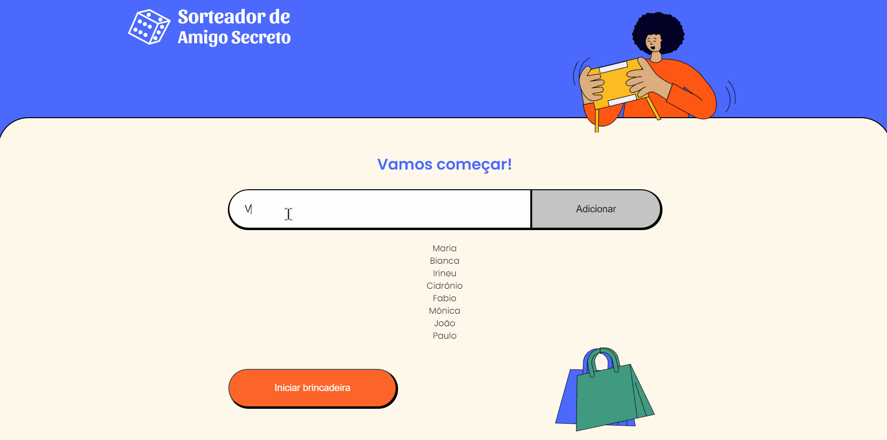

# Secret Santa 🎅

Play Secret Santa in a dynamic and secure way, as the portal was developed using TDD.

#### Feel free to explore, and if you have any questions, I'm available 24/7 for you 🫵

    

#### Link to the Website 🎯

    

#### ⬇️You can reach me at⬇️

 
    
    
    
     
    <h2>vinii.viniciusribeiro@gmail.com</h2>

#### Technologies used in this project 🤖

#### Knowledge Gained During the Process🤓

- Ran the script that executes the implemented tests;

- Found elements on the screen using @testing-library/react;

- Analyzed the test script output;

- Differentiated between the types of tests available;

- Developed a component using TDD;

- Installed the necessary libraries to manage routes and state;

- Created a hook that encapsulates access to the global state of participants;

- Used useRef to interact with the DOM and set focus on an input;

- Executed asynchronous code with setTimeout;

- Handled timers in tests using Jest;

- Prepared a mock for a custom hook;

- Validated whether methods were called by the tested component;

- Handled navigation with React Router DOM during tests;

- Performed snapshot tests;

- Located <option> elements by role;

- Tested whether the application's flow is executing as expected;

- Refactored code to facilitate test writing;

- Wrote accessible HTML using the concept of roles;

- Uploaded the project to GitHub;

- Configured deployment on Vercel;

- Ran tests to avoid publishing versions with failing tests.
